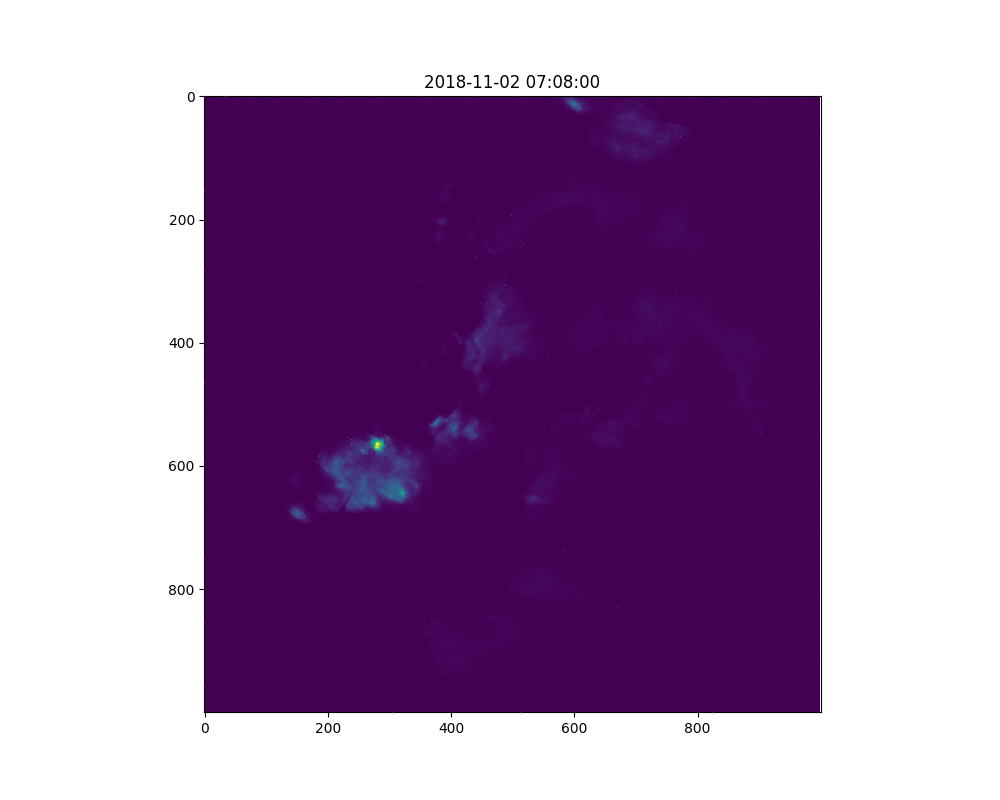

# Radar Forecast Model – Deep Learning

## Long Short-term Memory
LSTM is good at processing time series data.

The model structure can be decomposed by two networks, one is encoder, and the other is predictor.

Model configurations:  

Model Name|hidden layers|loss function|# training samples|tsize|# epochs|training process|Date
--------|--------|----------|----------|-------|--------------|--------|------|
newest-5_8| 16 |built-in RSME| 400| 10| 500| Fig.1|2019.5.8
newest-5-13|16|RMSE+FAR|400|10|500|Fig.2|2019.5.13

 
Fig.1 Training loss on 5.8
 
Fig.2 Comparison of predction and observation

### Wind Effect
To add wind effect in, one way is to customize the loss function by comparing LSTM modeled image at t and predicted image with Lagrangian plus wind at t. In this way, we drive the LSTM to the correct advection direction.

## GAN

In the GAN repository, we implement generative adversorial neural network to train the model. The reason behind is that, we hope GAN could help us to discriminate the input data.

## Semi-Lagrangian movement

## Optical Flow

We select one event from our radar data shown below

    

## Kalman Filter 

To be continued...
