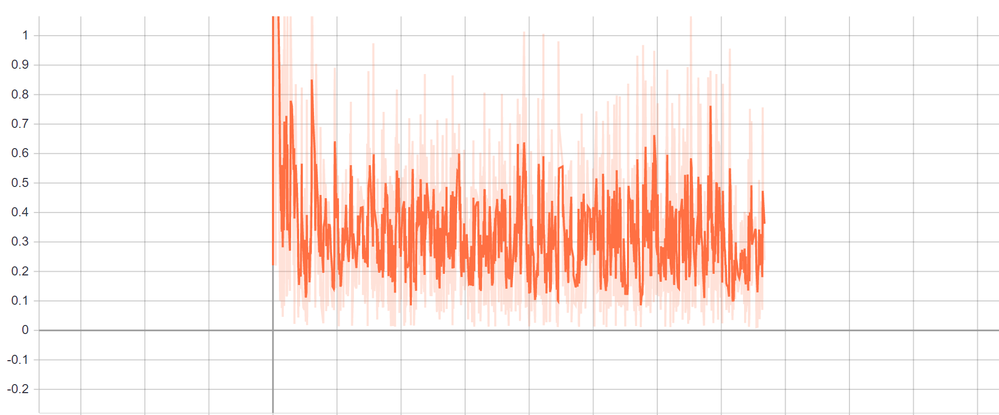
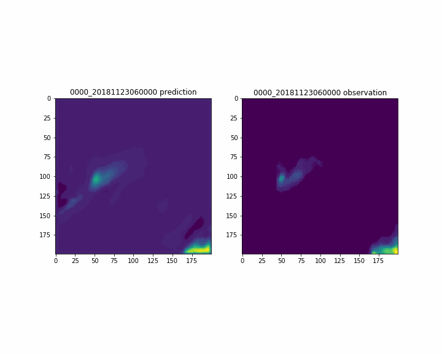

# Radar Forecast Model – Deep Learning

## Long Short-term Memory
LSTM is good at processing time series data.

The model structure can be decomposed by two networks, one is encoder, and the other is predictor.

Model configurations:
Model Name|hidden layers|# training samples|tsize|# epochs|training process|Date
--------|--------|----------|----------|--------------|--------|------|----
newest-5_8| 16 | 400| 10| 500| Fig.1|2019.5.8

 
Fig.1 Training loss on 5.8
 
Fig.2 Comparison of predction and observation

### Wind Effect

## GRU

## Optical Flow

## Kalman Filter 

To be continued...
