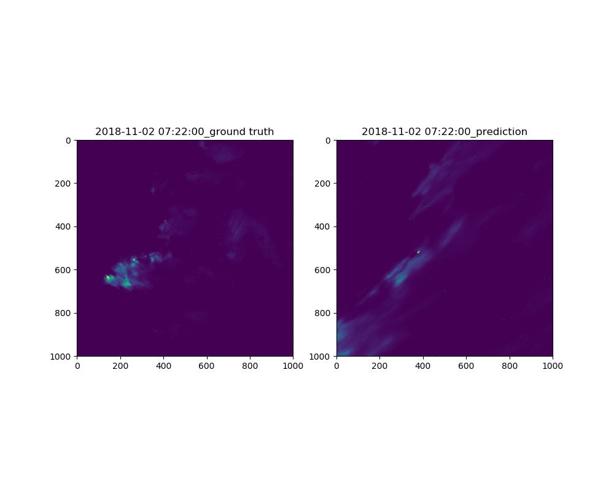

# Radar Forecast Model – Deep Learning

## Long Short-term Memory
LSTM is good at processing time series data.

The model structure can be decomposed by two networks, one is encoder, and the other is predictor.

Model configurations:

Model Name|hidden layers|loss function|# training samples|tsize|# epochs|training process|Date
--------|--------|----------|----------|-------|--------------|--------|------|
newest-5_8| 16 |built-in RSME| 400| 10| 500| Fig.1|2019.5.8
newest-5-13|16|RMSE+FAR|400|10|500|Fig.2|2019.5.13

 
Fig.1 Training loss on 5.8
 
Fig.2 Comparison of predction and observation

### Wind Effect
To add wind effect in, one way is to customize the loss function by comparing LSTM modeled image at t and predicted image with Lagrangian plus wind at t. In this way, we drive the LSTM to the correct advection direction.

## GAN

## GRU

We select one event from our radar data shown below

    

## Kalman Filter

## Semi-Lagrangian movement

we create several wind field to test the robustness of this algorithm with radar movement, the first goes with uniform speed gradient wind vector.

The basic idea of semi-lagrangian goes here ...
the stability analysis of semi-lagrangian algorithm goes here...

    
<!--     <FIGCAPTION>radar movement under uniform wind vector</FIGCAPTION> -->
    
<!--     <FIGCAPTION>radar movement under circular wind vector</FIGCAPTION> -->
    
<!--     <FIGCAPTION>radar movement under converging wind vector</FIGCAPTION> -->

**unsolved problem:**

1. when cloud converges due to conteract wind vector, it will collapse somehow.

## Optical Flow

The results are like this ...

Left panel is the ground truth, while the right is prediction.

This is pretty messy because the optical flow assumes that all pixels have the same intensity which is not the case in radar images because localized growth and decays may be generated.

Here is one implementation with optical flow [Motion Vectors in Weather Radars](http://citeseerx.ist.psu.edu/viewdoc/download?doi=10.1.1.539.99&rep=rep1&type=pdf)

## FlowNet

    

## Gaussian Mixture Models

A full description and simple code about how Gaussian Mixture Model (GMM) works can be found at [Jupyter Notebook](https://github.com/llSourcell/Gaussian_Mixture_Models/blob/master/intro_to_gmm_%26_em.ipynb)

## Kalman Filter

## To-do List
- [x] Test on circular wind vector (Semi-lagrangian)
